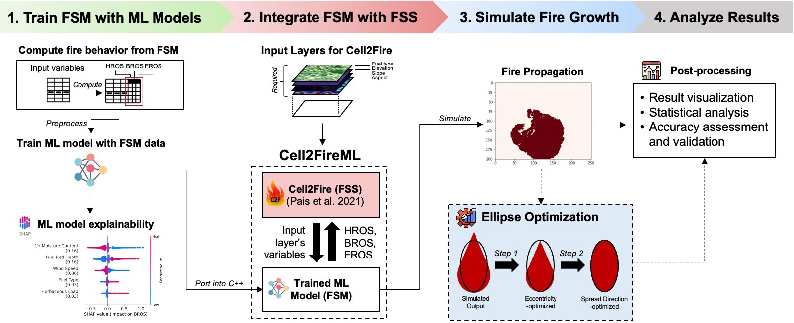

# Cell2FireML: An Open-Source Fire Spread Simulation Framework Using Machine Learning
[Minho Kim](https://minho.me), [Cristobal Pais](https://scholar.google.com/citations?user=-iFEF_YAAAAJ&hl), [Marta C. Gonzalez](https://scholar.google.com/citations?user=YAGjro8AAAAJ&hl=en)

# Abstract
With the escalating global impact of wildfires, operational fire simulation models have become crucial in real-time fire management. However, existing models are typically provided as closed-box systems and for specific geographic regions. In response, we developed an open-source fire spread simulation framework, Cell2FireML, that trains data obtained from semi-empirical fire behavior models using machine learning and provides the learned logic into a cellular automata simulator to simulate fire spread. Further, we also assessed the feature importance of the trained model’s inputs and predictions to make the framework more explainable. Through simulations on synthetic and real landscapes in various geographic regions (U.S., Canada, Chile), we demonstrated that Cell2FireML can produce highly accurate simulation outputs that are comparable with the best existing operational models. We also added a two-step optimization process that leverages real wildfire burn data to simulate more realistic simulations and surpass capabilities of existing models.

<br/>
<p align="center">
  
  <br><i>Graphical abstract of Cell2FireML's framework</i>
</p>

# Highlights⚡
* Developed an open-source, modular, and robust framework for fire spread simulations in the US, Canada, and Chile.
* ML models trained on three fire spread models (FSMs): (1) BehavePlus v6 (US); (2) FBP (Canada); (3) KITRAL (Chile), interpreted using Explainable AI (Shapley).
* Reproduced outputs by existing closed-box, semi-empirical fire spread simulators (FarSite, Prometheus) at high accuracy, and blackbox optimization used to better replicate real burns.

# Contents
1. [File directories](#Directories)
2. [Notebooks](#Notebooks)
3. [Running Cell2Fire](#Cell2Fire)
4. [Code Requirements](#Requirements)
5. [Other key resources](#Resources)

# File Directories
<a id="Directories"></a>

- Cell2Fire (Fire spread simulator): Cell2Fire (Python) and Cell2FireC (C++)
- Cell2Fire_results: Output folder for Cell2Fire simulations
- data: Data used for simulations, model training, optimization
- figures: Figures used in the publication
- notebooks: Main .ipynb notebooks to reproduce results
- plot: Main .ipynb notebooks to visualize results

# Notebooks
<a id="Notebooks"></a>

### Data preprocessing
- [generate_data.ipynb](notebooks/generate_data.ipynb): Generate training data (.csv) to run each FBM and train ML models.

### ML model training (FSM)
- [train_fsm.ipynb](notebooks/train_fsm.ipnb): Model training script with off-the-shelf ML models
- [train_fsm_xgboost.ipynb](notebooks/train_fsm_xgboost.ipynb): Training script for XGBoost (regressor) with visualization of loss curves

### Elliptical optimization
- [elliptical_optimization.ipynb](notebooks/elliptical_optimization.ipynb): Script to find initial optimal K-Factors used in elliptical optimization

### Cell2Fire simulations
- [Execute_Cell2Fire_US_example.ipynb](notebooks/Execute_Cell2Fire_US_example.ipynb): Notebook to simulate fire in the US and compare per hour
- [Execute_Cell2Fire_Canada_example.ipynb](notebooks/Execute_Cell2Fire_Canada_example.ipynb): Notebook to simulate Dogrib Fire (Canada) and apply BBO

### Visualization
- [plot_homogeneous.ipynb](notebooks/plot_homogeneous.ipynb): Visualization of homogeneous fuel landscapes (See Supplementary Materials)
- [plot_optimization.ipynb](notebooks/plot_optimization.ipynb): Visualization of elliptical optimization
- [plot_real.ipynb](notebooks/plot_real.iypnb): Visualization of real fuel landscapes (US, Canada, Chile)

# Installation
1. **Clone the Repository**: Clone the repository containing the environment YAML file to your local system.
   ```bash
   git clone https://github.com/humnetlab/Cell2FireML.git
2. Change your current directory to the repository directory. 
   ```bash
   cd Cell2FireML
  
3. Create the environment from the YAML file
   ```bash
   conda env create -f environment.yml

# Running Cell2Fire
<a id="Cell2Fire"></a>
Cell2Fire is provided for the US (Scott & Burgan fuels based on Behave), Canada (FBP), and Chile (KITRAL). Cell2FireML is currently programmed for Cell2Fire_US. Use the [notebook](notebooks/Execute_Cell2Fire_US_example.ipynb) to see an example of Cell2FireML's usage.

### 1) Compile and build Cell2Fire executable
**CMAKE BUILD**
Under the folder
```bash
cd /Users/minho/Documents/GitHub/Cell2FireML/Cell2FireC (Use full path)
mkdir build
cd build
cmake ..
make
```
### 2) Execute Cell2Fire
```bash
# The executable file has to be moved from the "build" folder to the Cell2FireC folder*
mv Cell2Fire .. 
cd ../..
# Example (Needs to be adjusted)
python main.py --input-instance-folder data_BP/f101/ --output-folder results/BP_f101_test/ --ignitions --sim-years 1 --nsims 1 --grids --finalGrid --weather rows --nweathers 1 --Fire-Period-Length 1.0 --ROS-CV 0.0 --output-messages --seed 123 --IgnitionRad 1 --stats --verbose --allPlots
```

# Code Requirements for Cell2Fire
<a id="Requirements"></a>

**C++**
- Boost
- Eigen

**Python**
- numpy
- pandas
- matplotlib
- seaborn
- tqdm
- rasterio
- networkx (for *stats* module)

# Other Key Resources on Cell2Fire
<a id="Resources"></a>

* Cell2Fire: [Github](https://github.com/cell2fire/Cell2Fire), [Paper](https://www.frontiersin.org/articles/10.3389/ffgc.2021.692706/full)
* Cell2Fire-KITRAL: [C2F+K](https://github.com/fire2a/C2FK)
* Cell2Fire-Scott&Burgan [C2F+S&B](https://github.com/fire2a/C2FSB)
* Cell2Fire for FBP, Scott&Burgan, KITRAL: [C2F-W](https://github.com/fire2a/C2F-W) <-- Most recent update and ongoing work by the Fire2A team!
* A great tutorial can be found at [C2F+K Tutorial](https://docs.google.com/presentation/d/1Y6fPAhDrSThGSvYFvqdccXTvVrUcvbHZsDLAwbfMD18/edit?usp=sharing)
 

# Acknowledgements
The authors acknowledge the support of C3.ai through the grant Multiscale analysis for Improved Risk Assessment of Wildfires facilitated by Data and Computation. 

# Citation
---------------------
**Please cite the journal paper if this code is useful and helpful for your research.**
