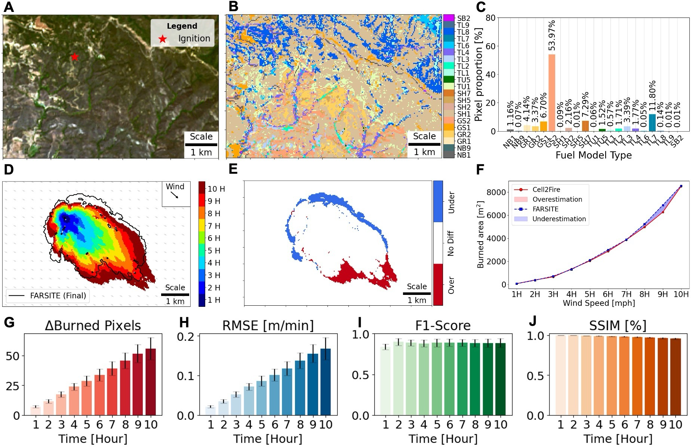

# Fire Spread Simulations Using Cell2Fire on Synthetic and Real Landscapes
[Minho Kim](https://minho.me), [Cristobal Pais](https://scholar.google.com/citations?user=-iFEF_YAAAAJ&hl), [Marta C. Gonzalez](https://scholar.google.com/citations?user=YAGjro8AAAAJ&hl=en)

# Highlights⚡
* 🔥 Cell2Fire accurately simulates in homogeneous and real landscapes in the US, Canada, and Chile.
* 🇺🇸 Cell2Fire applied for the first time in the US (Southern California).
* ⚙️ Blackbox optimization (BBO) used to better replicate real burns (2001 Dogrib Fire).
* 📊 Comprehensive uncertainty analysis on weather data variables and global adjustment factors.
* 📈 Sensitivity analysis including feature importance with SHAP values (using surrogate ML model)
  
<br/>
<p align="center">
  
  <br>Graphical abstract: Cell2Fire simulation of real landscape in the US compared to FarSite
</p>

# Abstract
Fire spread models (FSMs) are used to reproduce fire behavior and can simulate fire propagation over landscapes. As wildfires have emerged into a global phenomenon with far-reaching impacts on the natural and built environments, FSM simulations provide crucial information to better understand and predict fire behavior in various landscapes. In this study, we tested Cell2Fire, a recently developed cellular automata-based FSM, against benchmarking models used in the U.S., Canada, and Chile. We experimented on synthetically generated landscapes (homogeneous and heterogeneous mix of fuels), applying Cell2Fire for the first time on U.S. landscapes, and found a high level of agreement between Cell2Fire and existing FSMs. However, FSMs may not always produce realistic simulations. In response, we used two optimization methods to improve the simulation’s accuracy. First, we adopted a multi-objective optimization algorithm that scales the elliptical shape of the Cell2Fire’s output based on rate of spread (ROS) and eccentricity. Second, we optimized four adjustment factors related to the fire spread (head ROS, back ROS, flank ROS, and eccentricity) using blackbox optimization (i.e., derivative-free optimization), minimizing the discrepancy of the output with respect to real burn data. We assessed the effectiveness of the optimization on the 2001 Dogrib Fire in Alberta, Canada and found that the optimized Cell2Fire result more accurately predicted the real burn in comparison to Prometheus, the standard Canadian FSM. From these results, users can adjust Cell2Fire and simulate more realistic burns and surpass the capabilities of benchmark FSMs, integrating local or custom-made FSM data to expand the simulator’s application.


# Contents
1. [File directories](#Directories)
2. [Notebooks](#Notebooks)
3. [Data](#Data)
4. [Running Cell2Fire](#Cell2Fire)
5. [Code Requirements](#Requirements)
6. [Other key resources](#Resources)

# File Directories
<a id="Directories"></a>

- Cell2Fire (Fire spread simulator): Cell2Fire (Python) and Cell2FireC (C++)
- Cell2Fire_results: Output folder for Cell2Fire simulations
- data: Data used for simulations, model training, optimization
- figures: Figures used in the publication
- notebooks: Main .ipynb notebooks to reproduce results
- plot: Main .ipynb notebooks to visualize results

# Notebooks
<a id="Notebooks"></a>

### Elliptical optimization
- [elliptical_optimization.ipynb](notebooks/elliptical_optimization.ipynb): Script to find initial optimal K-Factors used in elliptical optimization

### Visualization
- [plot_homogeneous.ipynb](notebooks/plot_homogeneous.ipynb): Visualization of homogeneous fuel landscapes (See Supplementary Materials)
- [plot_optimization.ipynb](notebooks/plot_optimization.ipynb): Visualization of elliptical optimization
- [plot_real.ipynb](notebooks/plot_real.iypnb): Visualization of real fuel landscapes (US, Canada, Chile)

### Cell2Fire + Uncertainty analysis
- [uncertainty_canada.ipynb](notebooks/uncertainty_canada.ipynb): Cell2Fire simulations of the 2001 Dogrib Fire + Uncertainty analysis of weather data
- [uncertainty_canada_finetuning.ipynb](notebooks/uncertainty_canada_finetuning.ipynb): Cell2Fire simulations of the 2001 Dogrib Fire + Uncertainty analysis of adjustment factors (global)
- [uncertainty_us.ipynb](notebooks/uncertainty_us.ipynb): Cell2Fire simulations of real US landscape + Uncertainty analysis of adjustment factors (global)

# Data
<a id="Data"></a>

### Cell2Fire simulations
- [Homogeneous Data](data/homogeneous): Canada (20x20 grids sampled from Dogrib Fire), US (fuel type 101 at multiple wind speeds), Chile (80x80 grids)
- [Canada (Dogrib Fire)](data/real/dogrib): 2001 Dogrib Fire with sampled weather (for uncertainty analysis)
- [Canada (Dogrib Fire Reference)](data/real/Dogrib_v624/): 2001 Dogrib Fire with all observations, GIS data, and case report (Retrieved from Prometheus software website)
- [US (Real)](data/real/sherpa_10H): Samples of real US landscape  (e.g., at 10th hour of simulation)
- [Chile (Real)](data/real/chile_portuzeuelo): Chile's portuzeuelo fire

### Training data for ML model (SHAP analysis)
- [bp6_training_data.csv](data/fsm/bp6_training_data.csv): BehavePlus data generated via Rothermel equations from the [Rothermel R code](https://rdrr.io/cran/Rothermel/) by [Vacchiano & Ascoli (2015)](https://doi.org/10.1007/s10694-014-0405-6)
- [fbp_training_data.csv](data/fsm/fbp_training_data.csv): FBP data generated using /notebooks/FBPDataGenerator/DataGenerator_FBP.ipynb

# Installation
1. **Clone the Repository**: Clone the repository containing the environment YAML file to your local system.
   ```bash
   git clone https://github.com/humnetlab/Cell2Fire.git
2. Change your current directory to the repository directory. 
   ```bash
   cd Cell2Fire
  
3. Create the environment from the YAML file
   ```bash
   conda env create -f environment.yml

# Running Cell2Fire
<a id="Cell2Fire"></a>
Cell2Fire is provided for the US (Scott & Burgan fuels based on Behave), Canada (FBP), and Chile (KITRAL). 

### 1) Compile and build Cell2Fire executable
**CMAKE BUILD**
Under the folder
```bash
cd /Users/minho/Documents/GitHub/Cell2Fire/Cell2FireC (Use full path)
mkdir build
cd build
cmake ..
make
```
### 2) Execute Cell2Fire
```bash
# The executable file has to be moved from the "build" folder to the Cell2FireC folder*
mv Cell2Fire .. 
cd ../..
# Example (Needs to be adjusted)
python main.py --input-instance-folder data_BP/f101/ --output-folder results/BP_f101_test/ --ignitions --sim-years 1 --nsims 1 --grids --finalGrid --weather rows --nweathers 1 --Fire-Period-Length 1.0 --ROS-CV 0.0 --output-messages --seed 123 --IgnitionRad 1 --stats --verbose --allPlots
```

# Code Requirements for Cell2Fire
<a id="Requirements"></a>

**C++**
- Boost
- Eigen

**Python**
- numpy
- pandas
- matplotlib
- seaborn
- tqdm
- rasterio
- networkx (for *stats* module)

**Python (Uncertainty + Sensitivity Analysis)**
- skimage
- rasterio
- scikit-learn
- xgboost
- shap
- optuna

# Other Key Resources on Cell2Fire
<a id="Resources"></a>

* Cell2Fire: [Github](https://github.com/cell2fire/Cell2Fire), [Paper](https://www.frontiersin.org/articles/10.3389/ffgc.2021.692706/full)
* Cell2Fire-KITRAL: [C2F+K](https://github.com/fire2a/C2FK)
* Cell2Fire-Scott&Burgan [C2F+S&B](https://github.com/fire2a/C2FSB)
* Cell2Fire for FBP, Scott&Burgan, KITRAL: [C2F-W](https://github.com/fire2a/C2F-W) <-- Most recent update and ongoing work by the Fire2A team!
* A great tutorial can be found at [C2F+K Tutorial](https://docs.google.com/presentation/d/1Y6fPAhDrSThGSvYFvqdccXTvVrUcvbHZsDLAwbfMD18/edit?usp=sharing)
 

# Acknowledgements
The authors acknowledge the support of C3.ai through the grant Multiscale analysis for Improved Risk Assessment of Wildfires facilitated by Data and Computation. 

# Citation
---------------------
**Please cite the journal paper if this code is useful and helpful for your research.**
